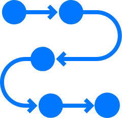

<!DOCTYPE html>
<html style="font-size: 16px;">
  <head>
    <meta name="viewport" content="width=device-width, initial-scale=1.0">
    <meta charset="utf-8">
    <meta name="keywords" content="INTUITIVE">
    <meta name="description" content="">
    <meta name="page_type" content="np-template-header-footer-from-plugin">
    <title>Page 1</title>
    <link rel="stylesheet" href="nicepage.css" media="screen">
<link rel="stylesheet" href="Page-1.css" media="screen">
    
    
    <meta name="generator" content="Nicepage 3.0.9, nicepage.com">
    <link id="u-theme-google-font" rel="stylesheet" href="https://fonts.googleapis.com/css?family=Roboto:100,100i,300,300i,400,400i,500,500i,700,700i,900,900i|Open+Sans:300,300i,400,400i,600,600i,700,700i,800,800i">
    <link id="u-page-google-font" rel="stylesheet" href="https://fonts.googleapis.com/css?family=Open+Sans:300,300i,400,400i,600,600i,700,700i,800,800i|Montserrat:100,100i,200,200i,300,300i,400,400i,500,500i,600,600i,700,700i,800,800i,900,900i">
    
  
    <meta property="og:title" content="Page 1">
    <meta property="og:type" content="website">
    <meta name="theme-color" content="#478ac9">
    <link rel="canonical" href="index.html">
    <meta property="og:url" content="index.html">
  </head>
  <body data-home-page="Page-1.html" data-home-page-title="Page 1" class="u-body"><header class="u-align-left u-clearfix u-header u-header" id="sec-a360">

</header>
    <section class="u-align-center u-clearfix u-white u-section-1" id="carousel_b908">
      
      <h1 class="u-custom-font u-font-open-sans u-text u-text-grey-80 u-title u-text-1">DASHBOARD</h1>
      

      <h2 class="u-custom-font u-font-open-sans u-text u-text-2">Welcome&nbsp; &nbsp;{Name}</h2>
      
Lorem ipsum dolor sit amet, consetetur sadipscing elitr, sed diam nonumy eirmod tempor invidunt ut labore et dolore magna aliquyam erat, sed diam voluptua. At vero eos et accusam et justo duo dolores et ea rebum. Stet clita kasd gubergren, no sea takimata sanctus est Lorem ipsum dolor sit amet. Lorem ipsum dolor sit amet, consetetur sadipscing elitr, sed diam nonumy eirmod tempor invidunt ut labore et dolore magna aliquyam erat, sed diam voluptua. At vero eos et accusam et justo duo dolores et ea rebum. Stet clita kasd gubergren, no sea takimata sanctus est Lorem ipsum dolor sit amet.

      
      
      
      
      

        

          

            <a href="https://nicepage.com" class="u-border-2 u-border-palette-1-base u-btn u-btn-round u-button-style u-radius-29 u-text-palette-1-base u-white u-btn-1">VIEW</a>
          

        

        

          

            <a href="https://nicepage.com/joomla-templates" class="u-border-2 u-border-palette-1-base u-btn u-btn-round u-button-style u-radius-29 u-text-palette-1-base u-white u-btn-2">VIEW</a>
          

        

        

          

            <a href="https://nicepage.com/website-templates" class="u-border-2 u-border-palette-1-base u-btn u-btn-round u-button-style u-radius-29 u-text-palette-1-base u-white u-btn-3">VIEW</a>
          

        

      

      
      <h2 class="u-text u-text-4">Check your application details
      </h2>
      
      <h2 class="u-text u-text-5">Check the status of your application</h2>
      <h2 class="u-text u-text-6">Deadline for the task</h2>
      
    </section>
    
    
    
    </section>
  </body>
</html>